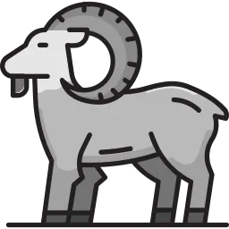

# Open Herd

[](https://github.com/eder-rimarachinr/open_herd/actions/workflows/ci.yml)

A local PHP development environment for Windows: serve your projects at `https://project.test` with nginx, any PHP version from 7.4 to 8.5 and trusted SSL certificates — managed from one small desktop app.



> Inspired by Laravel Herd, but an independent project — not affiliated with Laravel or Beyond Code.

**Platform status:** Windows 10/11 (x64) is supported. Linux and macOS are not functional yet (see [Platform status](#platform-status)).

---

## Features

- **Sites** — Add a project folder and it is served at `name.test`. Scan a projects directory to register every subfolder at once. Laravel, CodeIgniter 4/3, WordPress, SPA (`dist/` / `build/`) and static sites are detected and get the right document root.
- **PHP** — Install PHP 7.4 – 8.5 from windows.php.net (every download verified against a pinned SHA-256), or use the PHP already on your machine (XAMPP, WAMP, Laragon, `PATH`, or folders you configure). Pick the PHP version per site, and edit each version's `php.ini` extensions and settings from the app.
- **nginx** — Downloaded and verified on first use; vhosts are generated for every site.
- **HTTPS** — One click per site via [mkcert](https://github.com/FiloSottile/mkcert): certificates your browser trusts.
- **DNS** — `.test` entries are added to and removed from the Windows `hosts` file for you.
- **Site info** — Reads `.env` and framework files to show app name, framework version, environment, debug and maintenance mode.
- **Runs in the tray** — Closing the window keeps your sites up; quit from the tray icon. nginx and PHP are always stopped with the app, even if it crashes, and PHP is restarted automatically if it dies.
- **Safe with your data** — Settings and site lists are written atomically, unreadable files are set aside instead of overwritten, and the `hosts` file is backed up before every change.
- **Portable mode** — Run from a folder or USB drive with everything stored next to the exe.

---

## Install (Windows)

Download from the [Releases](https://github.com/eder-rimarachinr/open_herd/releases) page:

| File | Use it when |
|------|-------------|
| `open-herd-vX.Y.Z-setup.exe` | Recommended. Installs for all users (asks for administrator rights) and adds Start-menu and desktop shortcuts. |
| `open-herd-vX.Y.Z-x64.msi` | You deploy software with MSI tooling. |
| `open-herd-vX.Y.Z-portable.zip` | No installation: unzip anywhere and run `open-herd.exe`; data stays in the `data/` folder beside it. |

Or from PowerShell **as Administrator**:

```powershell
irm https://raw.githubusercontent.com/eder-rimarachinr/open_herd/main/installer/install.ps1 | iex
```

Notes:
- The installers are not code-signed yet, so Windows SmartScreen may warn about an unknown publisher (*More info → Run anyway*).
- Microsoft Edge WebView2 is installed automatically if it is missing.
- Upgrading: just install the new version over the old one. Your data is kept.

---

## Getting started

1. **Run Open Herd as administrator** (right-click → *Run as administrator*). It needs that to edit `C:\Windows\System32\drivers\etc\hosts`. Without it everything else works, but you must add `127.0.0.1  name.test` lines to `hosts` yourself.
2. **PHP** page → install a version (or press *Rescan* to find the ones you already have). In **Settings**, choose the default PHP version for new sites.
3. **Nginx** page → *Download Nginx* (first time only).
4. **Sites** page → **+** to add a project folder, or add your projects directory under *Scanned Dirs* and press **Scan**.
5. Press **Start all** in the sidebar, then open `http://name.test`.
6. Optional: select a site and press **Enable HTTPS**. The first time, mkcert installs its local root certificate; accept the prompt.

---

## Where your data lives

Installed: `%USERPROFILE%\.phpenv\` · Portable: `data\` next to `open-herd.exe` (portable mode turns on when `data\config.json` exists there).

```
.phpenv/
├── config.json              Settings (ports, default PHP, scanned dirs, PHP dirs)
├── sites.json               Registered sites
├── php/<major>/             PHP versions installed by Open Herd
├── nginx/
│   ├── nginx.conf           Generated on every start (previous one kept as nginx.conf.bak)
│   └── sites/*.conf         One vhost per site
├── certs/                   mkcert certificates (<domain>.pem, <domain>-key.pem)
├── mkcert.exe
└── logs/                    nginx/PHP logs, daemon-crash.log
```

If `config.json` or `sites.json` ever becomes unreadable, Open Herd renames it to `*.corrupt-<timestamp>`, starts with defaults and shows a warning banner. Your original file is kept. The previous `hosts` file is saved as `hosts.open-herd.bak` next to it.

---

## Troubleshooting

| Problem | What to do |
|---------|------------|
| nginx won't start / port 80 or 443 in use | Another web server is using it (Laravel Herd, IIS, Apache/XAMPP…). Stop it, or change the HTTP/HTTPS ports in **Settings**. |
| `name.test` doesn't resolve | Open Herd was not running as administrator when the site was added. Run it as administrator and press *Refresh config* on the site, or add the `hosts` line yourself. |
| Site answers 502 Bad Gateway | The site's PHP version isn't running. Press **Start all**, or start that version on the **PHP** page. |
| "Daemon offline" banner | The app's internal API (`127.0.0.1:7878`) didn't start. Usually another process holds that port. Restart Open Herd; the reason is in `logs\daemon-crash.log`. |
| Something else | The **Logs** page shows what the app did and nginx's error log. |

---

## Development

Requirements: **Rust** stable (1.88 or newer), **Node.js 24** (npm 11 — the lockfile depends on it), Windows 10/11. The production installer additionally needs `assets/logo.png`; Tauri downloads NSIS/WiX by itself.

```powershell
npm install
.\scripts\dev.ps1          # or: npm run tauri dev   — the full app with hot reload
npm run dev                # frontend only at http://localhost:1420 (no backend)
```

Starting a dev build asks any running Open Herd to quit first (both use port 7878).

### Tests

```bash
cd src-tauri
cargo test                 # unit + HTTP integration tests (never touch hosts, trust store or Explorer)
cargo test -- --ignored    # also download real PHP and mkcert into temp dirs
cargo clippy --all-targets # must stay warning-free

# from the repo root
npm test
npm run lint
```

### Build and release

```powershell
.\scripts\build-portable.ps1   # release\open-herd-vX.Y.Z-setup.exe, -x64.msi, -portable.zip
```

To publish a release, set the same version in `src-tauri/Cargo.toml`, `src-tauri/tauri.conf.json` and `package.json`, commit, and push an annotated tag `vX.Y.Z`. [`release.yml`](.github/workflows/release.yml) runs the tests, builds the installers on GitHub Actions and attaches them to a **draft** release for you to review and publish.

---

## Architecture

Open Herd is a single [Tauri v2](https://tauri.app) application. The backend is not a separate service: an HTTP API (axum) runs on a background thread of the same process, on `127.0.0.1:7878`, and the React UI talks to it. The API only accepts requests from the local machine and from the app's own window.

```
┌──────────────────────── open-herd.exe ────────────────────────┐
│  React + TypeScript (WebView2)  ──fetch──►  Rust API (axum)   │
│                                              127.0.0.1:7878   │
└───────────────────────────────────────────────┬───────────────┘
                                                 │ manages
                        nginx.exe · php-cgi.exe · mkcert · hosts file
```

```
open_herd/
├── src/                   React + TypeScript UI (Vite)
├── src-tauri/             Rust: Tauri shell + backend
│   ├── src/
│   │   ├── domain/          business rules: Site, value objects, ports (traits)
│   │   ├── application/     use cases: CreateSite, EnableSsl, StartServices, …
│   │   ├── infrastructure/  adapters: nginx, php-cgi, mkcert, hosts file, JSON storage
│   │   └── ports/http/      thin axum handlers
│   ├── tests/             HTTP integration tests
│   └── tauri.conf.json
├── scripts/               dev.ps1, build-portable.ps1
├── installer/             install.ps1 (Windows), install.sh (Linux, not usable yet)
├── assets/logo.png        source of the app icons
└── .github/workflows/     ci.yml, release.yml
```

Stack: Tauri 2 · React 18 · TypeScript · Vite · Rust (axum, tokio, reqwest, tracing).

### Project type detection

| Type | Detected by | Document root |
|------|-------------|---------------|
| Laravel | `artisan` + `public/` | `public/` |
| CodeIgniter 4 | `spark` | `public/` |
| CodeIgniter 3 | `application/` + `system/` + `index.php` | project root |
| WordPress | `wp-config.php` or `wp-login.php` | project root |
| SPA | `dist/index.html` or `build/index.html` | `dist/` or `build/` |
| Static | `index.html` | project root |
| Generic | anything else | project root, directory listing on |

---

## Platform status

| | Windows | Linux | macOS |
|---|---|---|---|
| App, sites, nginx, SSL, hosts | ✅ | 🚧 | 🚧 |
| PHP | `php-cgi.exe` on `127.0.0.1:9000 + major×10 + minor` (8.2 → 9082) | 🚧 needs php-fpm support | 🚧 |
| Installers / releases | ✅ NSIS, MSI, portable zip | ❌ not published | ❌ |
| nginx/PHP stopped if the app crashes | ✅ | 🚧 | 🚧 |

Linux and macOS support is planned; until then `installer/install.sh` has no release assets to download.

---

## License

[MIT](LICENSE) © Eder R
